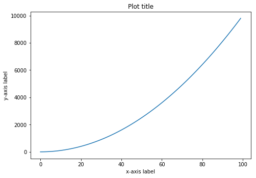
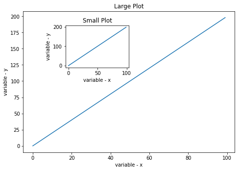
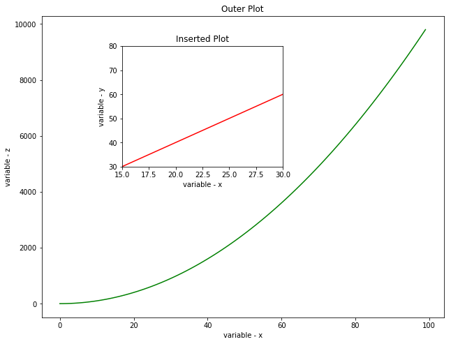
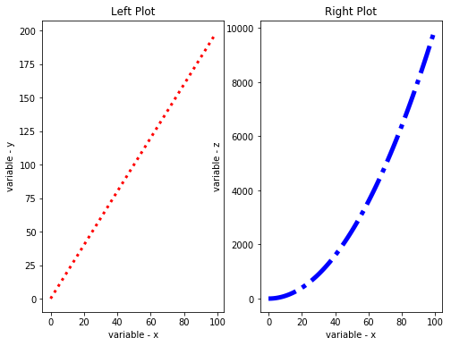
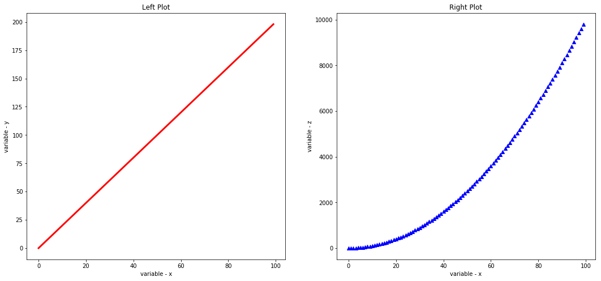

# Basic Plotting with `matplotlib` 

## Objectives
* Create sample data for plotting exercises.
* Plot and label simple line graphs.
* Define, plot and label multiple absolute axes using `add_axes()` function. 
* Define, plot and label multiple axes using `add_subplot()` function. 


## Introduction

This lab requires you to draw some basic visualizations using the techniques learnt in the previous lesson "Data Visualization with matplotlib". 

Let's first generate some data to carry out following exercises:

Perform following tasks:

* Create a variable x using numpy's `.arange()` function containing values from 0 to 99.

* Create a second variable y by multiplying each value in x by 2. 

* Create a third variable z as square of values in x.

* Print x, y and z


```python
import numpy as np

```

Import `matplotlib.pyplot` as `plt` and set `%matplotlib inline`  for generating inline images in jupyter notebooks. 


```python
# import matplotlib.pyplot and set inline plotting 

```

Now that we have our data all set and matplotlib in our python environment, we can try some basic plotting techniques.

## Exercise 1

Perform the following steps in the cell below:

* Create a new figure object `fig` using `.figure()` function.
* Use `add_axes()` to add an axis `ax` to the canvas at absolute location [0,0,1,1].
* Plot (x,y) on that axes and set the labels and title. 


```python

```





This was easy, let's move on to drawing multiple plots within a figure space. 

## Exercise 2

Perform following actions:

* Create a figure object `fig` and put two axes on it, `ax1` and `ax2`. 
* Set the locations of `ax1` and `ax2` at [0,0,1,1] and [.2,.6,.3,.3] respectively.
* Plot x and y on both axes. 
* Label the axes with variable names and give the plots titles as "Small Plot" and "Large Plot". 


```python

```





## Exercise 3

Perform following tasks in the cell below:

* Create a new figure of size 8 x 6 inches. 
* Create the plot below by adding two absolute axes to the figure object at [0,0,1,1] and [0.2,0.5,.4,.4].

* Use x,y, and z arrays to create:
    * Large plot between x and z. 
    * Small (inserted) plot between x and y. 

* Set the axes range for small plot as 15 - 45 for x-axis, and 30 - 80 for y -axis
* Set the line color for outer and inserted plots as green and red respectively
* Label your axes and give suitable titles to the plot.


```python

```





## Exercise 4

Perform following steps in the cell below:

* Create a figure of size 8x6 inches
* Add two axes using relative subplots to the figure by dividing it in 1 row and 2 columns
* Plot (x,y) and (x,z) on the ax1 and ax2 respectively. 
* Set the line width of first axes to 3, line style as dotted and color it red.
* Set the line width of second axes to5, line style as dash-dot (-.) and color it blue.
* Give the plots some labels and titles


```python

```





## Exercise 5

Above figure looks fine but a bit out of proportion. Let's resize this to make the plots look more appealing by ensuring that subplots are square in shape. Also change the line style of first plot (left) and change the type of 2nd plot (right) to a scatter plot with a `^` marker style.


```python

```





Congratulations, You have now learnt the basics plotting/labelling and customization techniques in matplotlib. Following lessons will focus on employing these techniques to plot for multiple data types in different analysis contexts. 


### Summary :

This lab focused on ensuring that you understand the basics plotting techqniues in matplotlib using plotting objects and functions to draw single plots, multiple/subplots using absolute and relative plotting. You also learnt how to customize the plots with labels, titles and axes definitions. Next we shall look into plotting more interesting plots with some real data. 
